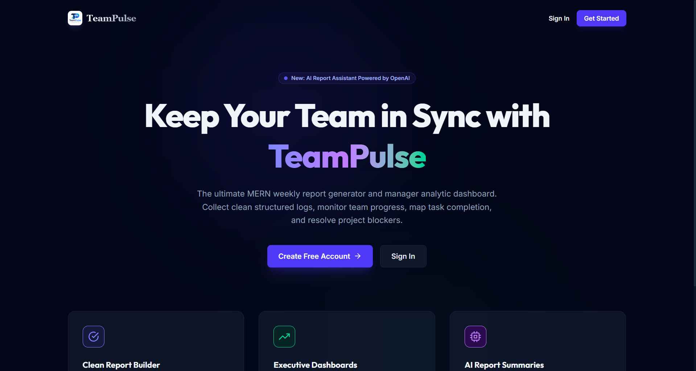
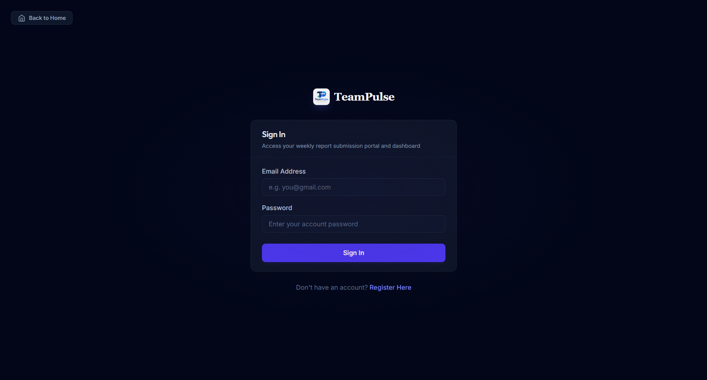
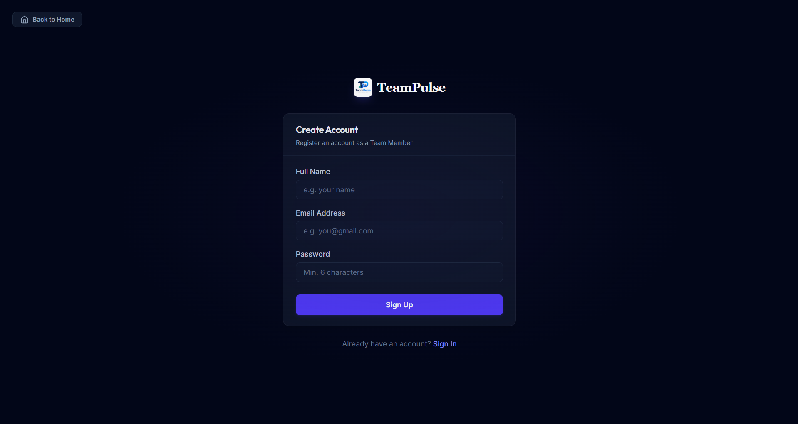
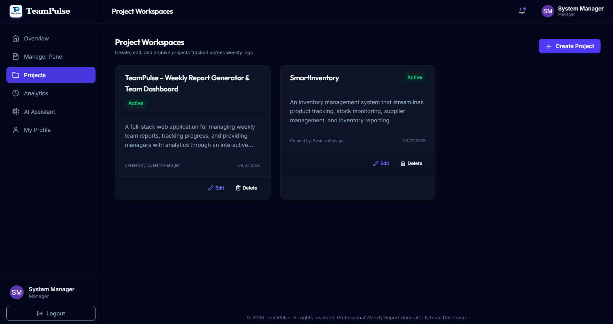
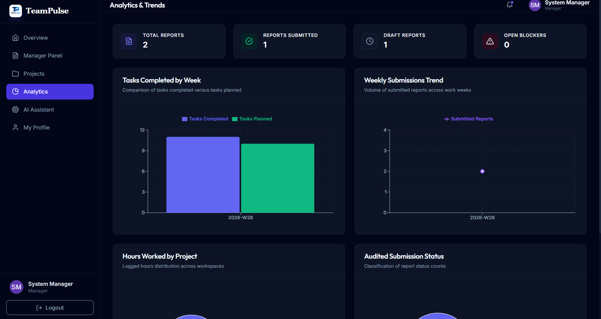

# TeamPulse - Weekly Report Generator & Team Dashboard

TeamPulse is a production-ready MERN stack application for managing weekly employee reports, team performance, and project progress. It includes role-based dashboards, report submission workflows, analytics, and an AI assistant.

## Live Demo

- Frontend: https://weekly-report-generator-olive.vercel.app/
- Backend API: https://weekly-report-generator-fpxu.onrender.com/

## Screenshots

### General Views

<table>
  <tr>
    <td align="center">
      <br />
      <b>Home page</b>
    </td>
    <td align="center">
      <br />
      <b>Login page</b>
    </td>
    <td align="center">
      <br />
      <b>Register page</b>
    </td>
  </tr>
</table>

### Manager Role

<table>
  <tr>
    <td align="center">
      <br />
      <b>Manager dashboard</b>
    </td>
    <td align="center">
      <br />
      <b>Manage panel</b>
    </td>
    <td align="center">
      <br />
      <b>Create projects</b>
    </td>
  </tr>
  <tr>
    <td align="center">
      <br />
      <b>Projects</b>
    </td>
    <td align="center">
      <br />
      <b>Analytics</b>
    </td>
    <td align="center">
      <br />
      <b>AI assistant</b>
    </td>
  </tr>
  <tr>
    <td align="center">
      <br />
      <b>Manager profile</b>
    </td>
  </tr>
</table>

### Team Member Role

<table>
  <tr>
    <td align="center">
      <br />
      <b>Team member dashboard</b>
    </td>
    <td align="center">
      <br />
      <b>Create report</b>
    </td>
    <td align="center">
      <br />
      <b>My reports</b>
    </td>
  </tr>
  <tr>
    <td align="center">
      <br />
      <b>Projects</b>
    </td>
    <td align="center">
      <br />
      <b>Analytics</b>
    </td>
    <td align="center">
      <br />
      <b>Team member profile</b>
    </td>
  </tr>
</table>

## Features

- Role-based access for managers and team members
- Weekly report creation, editing, saving drafts, and submission
- Manager analytics dashboards with charts
- AI assistant for summary and blocker insights
- Secure authentication with JWT and password hashing

## Tech Stack

- Frontend: React, Vite, React Router, Tailwind CSS, Axios, Recharts
- Backend: Node.js, Express.js, MongoDB, Mongoose, JWT, bcryptjs
- Dev tooling: concurrently

## 1. Installing Dependencies

From the project root, install everything with:

```bash
npm run install:all
```

This installs the root tools plus the backend and frontend packages.

If you prefer to install them separately:

```bash
npm install
cd backend && npm install
cd ../frontend && npm install
```

## 2. Running the Frontend

Start the Vite frontend:

```bash
cd frontend
npm run dev
```

Open:

```text
http://localhost:5173
```

## 3. Running the Backend

Start the Express backend:

```bash
cd backend
npm run dev
```

The API will run on:

```text
http://localhost:5000
```

You can verify it with:

```bash
curl http://localhost:5000/api/health
```

## 4. Running the Database

### Option A: Local MongoDB

Install and start MongoDB locally, then use:

```bash
mongod
```

Set your connection string in backend/.env:

```env
MONGODB_URI=mongodb://localhost:27017/teampulse
```

### Option B: MongoDB Atlas

Use your Atlas connection string in backend/.env:

```env
MONGODB_URI=mongodb+srv://<username>:<password>@<cluster-url>/<database>?retryWrites=true&w=majority
```

> If your password contains special characters like &, encode them as %26.

## Environment Variables

Create a file named backend/.env and add values like:

```env
PORT=5000
MONGODB_URI=mongodb://localhost:27017/teampulse
JWT_SECRET=your_jwt_secret
JWT_EXPIRE=30d
JWT_COOKIE_EXPIRE=30
CLIENT_URL=http://localhost:5173
OPENAI_API_KEY=your_openai_api_key_here
NODE_ENV=development
```

## Deployment

### Render (Backend)

- Root Directory: backend
- Build Command: npm install
- Start Command: node server.js

Required environment variables on Render:

- MONGODB_URI
- JWT_SECRET
- CLIENT_URL
- OPENAI_API_KEY (optional for AI features)
- NODE_ENV=production

### Vercel (Frontend)

- Root Directory: frontend
- Framework Preset: Vite
- Build Command: npm run build
- Output Directory: dist

Required environment variable on Vercel:

- VITE_API_URL=https://weekly-report-generator-fpxu.onrender.com

